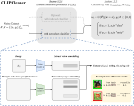

## **CLIPCleaner: Cleaning Noisy Labels with CLIP**

<p align="center">
    
</p>

This is the official PyTorch implementation of ACMMM2024 paper  ([CLIPCleaner: Cleaning Noisy Labels with CLIP](https://www.arxiv.org/abs/2408.10012)). 

### Abstract
Learning with Noisy labels (LNL) poses a significant challenge for the Machine Learning community. Some of the most widely used approaches that select as clean samples for which the model itself (the in-training model) has high confidence, e.g., 'small loss', can suffer from the so called 'self-confirmation' bias. This bias arises because the in-training model, is at least partially trained on the noisy labels. Furthermore, in the classification case, an additional challenge arises because some of the label noise is between classes that are visually very similar (`hard noise'). 
This paper addresses these challenges by proposing a method (*CLIPCleaner*) that leverages CLIP, a powerful Vision-Language (VL) model for constructing a zero-shot classifier for efficient, offline, clean sample selection. 
This has the advantage that the sample selection is decoupled from the in-training model and that the sample selection is aware of the semantic and visual similarities between the classes due to the way that CLIP is trained. We provide theoretical justifications and empirical evidence to demonstrate the advantages of CLIP for LNL compared to conventional pre-trained models.
Compared to current methods that combine iterative sample selection with various techniques, *CLIPCleaner* offers a simple, single-step approach that achieves competitive or superior performance on benchmark datasets. To the best of our knowledge, this is the first time a VL model has been used for sample selection to address the problem of Learning with Noisy Labels (LNL), highlighting their potential in the domain.

```bibtex
@InProceedings{Feng_2024_ACMMM,
    author    = {Feng, Chen and Tzimiropoulos, Georgios and Patras, Ioannis},
    title     = {CLIPCleaner: Cleaning Noisy Labels with CLIP},
    booktitle = {The 32nd ACM International Conference on Multimedia},
    month     = {October},
    year      = {2024}
}
```
Please considering ***cite our paper and star the repo*** if you find this repo useful.

### Preparation
- pytorch
- tqdm
- wandb
- clip


### Usage

Please refer to `clipcleaner.py` for the sample selection method.

For complete runs, please refer to `main.py`. Some example runs to reproduce paper results below:

- CIFAR10: 
```
CUDA_VISIBLE_DEVICES=0 python main.py --dataset cifar10 --dataset_path ../datasets/CIFAR/CIFAR10 --noise_mode sym --noise_ratio 0.5 --beta 1 --theta_r 0.8 --theta_r2 0.8 --theta_gmm 0.5 --theta_cons 0.8 --gpuid 0
```
- CIFAR100:
```
CUDA_VISIBLE_DEVICES=1 python main.py --dataset cifar100 --dataset_path ../datasets/CIFAR/CIFAR100 --noise_mode sym --noise_ratio 0.5 --beta 1 --theta_r 0.8 --theta_r2 0.8 --theta_gmm 0.5 --theta_cons 0.8 --gpuid 1
```
- CIFAR10 with instance-dependent noise:
```
CUDA_VISIBLE_DEVICES=2 python main.py --dataset cifar10-IND --dataset_path ../datasets/CIFAR/CIFAR10 --noise_ratio 0.4 --beta 1 --theta_r 1 --theta_r2 1 --theta_gmm 0.5 --theta_cons 0.8 --gpuid 2
```
- ANIMAL-10N:
```
CUDA_VISIBLE_DEVICES=1 python main.py --dataset animal10n --dataset_path ../datasets/ANIMAL-10N --noise_ratio 0.4 --beta 0.5 --theta_r 0.7 --theta_r2 0.95 --theta_gmm 0.5 --theta_cons 0.8 --gpuid 1
```
- Red ImageNet:
```
CUDA_VISIBLE_DEVICES=0 python main.py --dataset red_imagenet --dataset_path ../datasets/CNLW/dataset/mini-imagenet --batch_size 64 --noise_ratio 0.4 --beta 4 --theta_r 0.8 --theta_r2 0.95 --theta_gmm 0.5 --theta_cons 0.8 --gpuid 0
```
- WebVision:
```
CUDA_VISIBLE_DEVICES=2 python main.py --dataset webvision --dataset_path ../datasets/WebVision --batch_size 64 --epochs 150 --milestones 80 120 --beta 0.5 --theta_r 0.7 --theta_r2 1 --theta_gmm 0.5 --theta_cons 1.0 --gpuid 2
```

Please check Stackoverflow/Pytorch Forum/Google/ChatGPT for code debugging/package dependency/non-methodology issues.

### License
This project is licensed under the terms of the MIT license.
